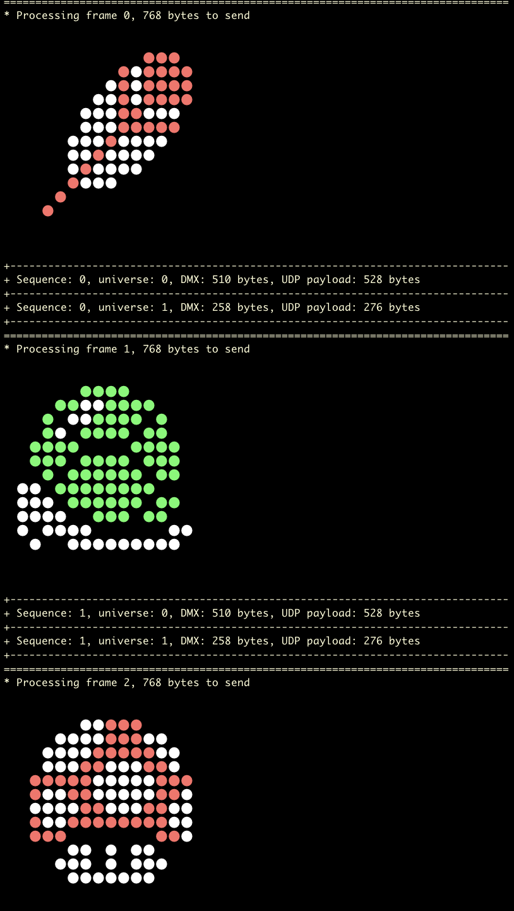

# artnet
Artnet stuffs (ws2812, led matrix, dmx512)

## artnetsend.py 

`artnetsend.py` is a tool that sends raw rgb24 images using [Artnet protocol](https://en.wikipedia.org/wiki/Art-Net) to compatible endpoints such as [WLED](https://kno.wled.ge/). I've worked on this tool because I didn't find any command line tool that is compatible with [WLED](https://kno.wled.ge/). If you too find this tool useful that's cool.

### usage

    ./artnetsend.py -h
    usage: arnetplay.py [-h] [-v] [-W WIDTH] [-H HEIGHT] [-d DESTINATION [DESTINATION ...]] [-p PORT] [-f FPS] [-r REPEAT] [-L LOOP] [-s] [-b] filepath [filepath ...]

    Send raw images using Artnet protocol

    positional arguments:
    filepath              Raw image (rgb24) filepath

    options:
    -h, --help            show this help message and exit
    -v, --verbose         Verbose level (on stderr)
    -W WIDTH, --width WIDTH
                            Frame width in pixels
    -H HEIGHT, --height HEIGHT
                            Frame height in pixels
    -d DESTINATION [DESTINATION ...], --destination DESTINATION [DESTINATION ...]
                            IP destination address (default 127.0.0.1). Multiple unicast adresses can be provided.
    -p PORT, --port PORT  UDP destination port (default 6454)
    -f FPS, --fps FPS     Frame Per Second (default 5)
    -r REPEAT, --repeat REPEAT
                            UDP packet repeat (default none)
    -L LOOP, --loop LOOP  Number of loop to play (infinite loop by default)
    -s, --show            Show frames (on stdout)
    -b, --box             Use boxes instead of dots when showing frames

    Made with ♥ in Python

### show with dots

    ./artnetsend.py -s -L 1 ./raw16x16/goomba_1.data

### show with squares

    ./artnetsend.py -b -s -L 1 ./raw16x16/goomba_1.data

### example

    ./artnetsend.py -v -s -L 1 ./raw16x16/mario-bonus*

## artnetrelay.py

`artnetrelay.py` is a tool that receives raw rgb24 frames (eg. rawvideo from ffmpeg) and forward them raw using [Artnet protocol](https://en.wikipedia.org/wiki/Art-Net) to compatible endpoints such as [WLED](https://kno.wled.ge/).

## usage

    ./artnetrelay.py -h
    usage: arnetrelay.py [-h] [-v] [-W WIDTH] [-H HEIGHT] [-d DESTINATION [DESTINATION ...]] [-p PORT] [-l LISTEN_PORT] [-r REPEAT] [-F FRAMES] [-s] [-b]

    Forward raw frames (eg. ffmpeg rawvideo/UDP) using Artnet protocol

    options:
    -h, --help            show this help message and exit
    -v, --verbose         Verbose level (on stderr)
    -W WIDTH, --width WIDTH
                            Frame width in pixels
    -H HEIGHT, --height HEIGHT
                            Frame height in pixels
    -d DESTINATION [DESTINATION ...], --destination DESTINATION [DESTINATION ...]
                            IP destination address (default 127.0.0.1). Multiple unicast adresses can be provided.
    -p PORT, --port PORT  UDP destination port (default 6454)
    -l LISTEN_PORT, --listen-port LISTEN_PORT
                            UDP listen port (default 1234)
    -r REPEAT, --repeat REPEAT
                            UDP packet repeat (default none)
    -F FRAMES, --frames FRAMES
                            Number of frames to forward before exit (infinite by default)
    -s, --show            Show frames (on stdout)
    -b, --box             Use boxes instead of dots when showing frames

    Made with ♥ in Python

### example

First start the artnetrelay:

    ./artnetrelay.py -W 32 -H 32  -d wled-WLED.local

You can then for example send video from ffmpeg:

    ffmpeg -re -i somevideo.mp4 -an -vf crop=32:32 -vf scale=32:-1 -f rawvideo -pix_fmt rgb24 -s 32x32 udp://127.0.0.1:1234

### important note

Artnetrelay receives all the udp payloads for the current frame before processing it. UDP is not reliable so it should only work on localhost. In the case the video must be transmitted over the network you should move the artnetrelay node so that artnet protocol is used over the network or you may use an ffmpeg chaining like this `ffmpeg -> RTP or MPEGTS over network -> ffmpeg -> UDP raw` to guaranty the data ordering.

## raw rgb24 image

A raw rgb24 image is a sequence of R,G,B triplets of byte for every pixels in the image. The pixels come in order from the top left corner pixel to the bottom right corner pixel, line by line.
The file size of the raw rgb24 image should be `width x height x 3` bytes. As an example, a 16x16 raw rgb24 image is 768 bytes.

### converting PNG to raw rgb24 16x16 images

    for png in *.png;do convert -size 16x16 $png -depth 8 -colorspace RGB ../raw16x16/${png%.png}.rgb;done

### converting GIF to raw rgb24 16x16 images

    ffmpeg -i anim.gif -pix_fmt rgb24 -s 16x16 ./out/anim_%d.raw

### converting GIF with transparent background to raw rgb24 16x16 images with dark green (003b10) background

    ffmpeg -f lavfi -i color=003b10 -i anim.gif -filter_complex "[0][1]scale2ref[bg][gif];[bg]setsar=1[bg];[bg][gif]overlay=shortest=1" -pix_fmt rgb24 -s 16x16 ./out/anim_%d.raw

### editing raw images with GIMP 2.10

I've noticed that raw images file extension must be `.data` to be open in GIMP 2.10 with the appropriate loader.