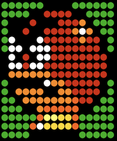
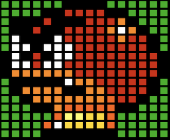

# artnet
Artnet stuffs (ws2812, led matrix, dmx512)

## artnetsend.py 

`artnetsend.py` is a tool that sends raw rgb24 images using [Artnet protocol](https://en.wikipedia.org/wiki/Art-Net) to compatible endpoints such as [WLED](https://kno.wled.ge/). I've worked on this tool because I didn't find any command line tool that is compatible with [WLED](https://kno.wled.ge/). If you too find this tool useful that's cool.

### raw rgb24 image

A raw rgb24 image is a sequence of R,G,B triplets of byte for every pixels in the image. The pixels come in order from the top left corner pixel to the bottom right corner pixel, line by line.
The file size of the raw rgb24 image should be `width x height x 3` bytes. As an example, a 16x16 raw rgb24 image is 768 bytes.

### usage

    ./artnetsend.py -h
    usage: arnetplay.py [-h] [-v] [-d DESTINATION] [-p PORT] [-f FPS] [-r REPEAT]
                    [-l LOOP] [-s] [-b]
                    filepath [filepath ...]

    Send raw images using Artnet protocol

    positional arguments:
    filepath              Raw image (rgb24) filepath

    options:
    -h, --help            show this help message and exit
    -v, --verbose         Verbose level
    -d DESTINATION, --destination DESTINATION
                            IP destination address (default 127.0.0.1)
    -p PORT, --port PORT  UDP destination port (default 6454)
    -f FPS, --fps FPS     Frame Per Second (default 5)
    -r REPEAT, --repeat REPEAT
                            UDP packet repeat (default none)
    -l LOOP, --loop LOOP  Number of loop to play (infinite loop by default)
    -s, --show            Show frames
    -b, --box             Use boxes instead of dots when showing frames

    Made with ♥ in Python

### show with dots

    ./artnetsend.py -s -l 1 ./raw16x16/goomba_1.data

### show with squares

    ./artnetsend.py -b -s -l 1 ./raw16x16/goomba_1.data

### example

    ./artnetsend.py -v -s -l 1 ./raw16x16/mario-bonus*

### converting PNG to raw rgb24 16x16 images

    for png in *.png;do convert -size 16x16 $png -depth 8 -colorspace RGB ../raw16x16/${png%.png}.rgb;done

### converting GIF to raw rgb24 16x16 images

    ffmpeg -i anim.gif -pix_fmt rgb24 -s 16x16 ./out/anim_%d.raw

### converting GIF with transparent background to raw rgb24 16x16 images with dark green (003b10) background

    ffmpeg -f lavfi -i color=003b10 -i anim.gif -filter_complex "[0][1]scale2ref[bg][gif];[bg]setsar=1[bg];[bg][gif]overlay=shortest=1" -pix_fmt rgb24 -s 16x16 ./out/anim_%d.raw

### editing raw images with GIMP 2.10

I've noticed that raw images file extension must be `.data` to be open in GIMP 2.10 with the appropriate loader.

### missing features (future work)

- images that are not square won't be correctly shown with the `--show` option. However they will be correctly handled in the artnet protocol as it doesn't care.
- network relay isn't implemented yet but I have the idea in my mind (receiving raw rgb24 ffmpeg output on UDP and forwarding with artnet protocol)
- multiple unicast destinations isn't supported yet but it will be easy to add thanks to argparse usage